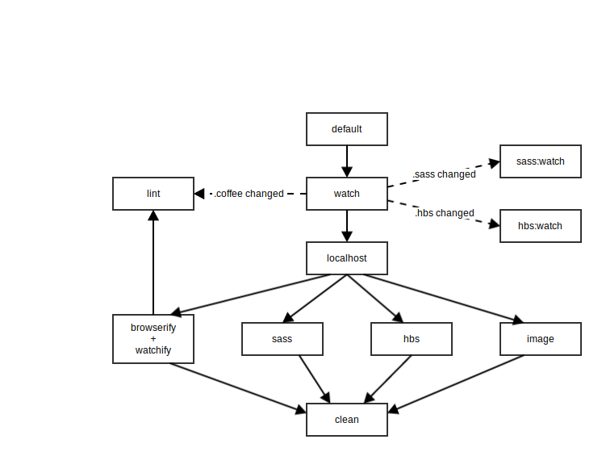
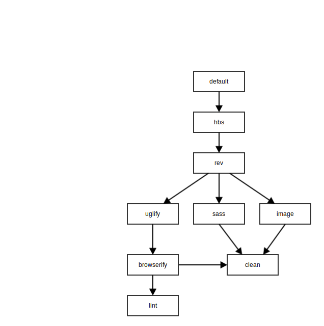

gulp-coffee-sass-hbs-starter
============================

Starter Gulp project with examples of how to accomplish some common tasks and workflows.

Includes the following tools, tasks, and workflows:

- [SASS](http://sass-lang.com/) with [autoprefixer](https://github.com/sindresorhus/gulp-autoprefixer)
- [CoffeeScript](http://coffeescript.org/) linted by [CoffeeLint](https://github.com/janraasch/gulp-coffeelint)
- [Browserify](http://browserify.org/) using [coffeeify](https://github.com/jnordberg/coffeeify) and [hbsfy](https://github.com/epeli/node-hbsfy) transforms
- [Watchify](https://github.com/substack/watchify) (caching version of browserify for super fast rebuilds)
- [BrowserSync](http://browsersync.io) for live reloading and a static server
- [Image optimization](https://www.npmjs.com/package/gulp-imagemin)
- Error handling in the console [and in Notification Center](https://github.com/mikaelbr/gulp-notify)
- Separate compression task using [Uglify.js](https://github.com/terinjokes/gulp-uglify) for production builds

If you've never used Node or npm before, you'll need to install Node.
If you use homebrew, do:

```
brew install node
```

Otherwise, you can download and install from [here](http://nodejs.org/download/).

### Install npm dependencies
```
npm install
```

This runs through all dependencies listed in `package.json` and downloads them to a `node_modules` folder in your project directory.

### The `gulp` command
To run the version of gulp installed local to the project, in the root of your this project, you'd run

```
./node_modules/.bin/gulp
```

**WAT.** Why can't I just run `gulp`? Well, you could install gulp globally with `npm install -g gulp`, which will add the gulp script to your global bin folder, but it's always better to use the version that's specified in your project's package.json.  My solution to this is to simply alias `./node_modules/.bin/gulp` to `gulp`. Open up `~/.zshrc` or `~./bashrc` and add the following line:

```
alias gulp='node_modules/.bin/gulp'
```
Now, running `gulp` in the project directory will use the version specified and installed from the `package.json` file.

### Run gulp and be amazed.

```
gulp
```

This will run the `default` gulp task defined in `gulp/tasks/default.coffee`.
Without further arguments, the task is run in development mode, where it has these task dependencies:



- The `sass` task compiles your css files.
- `images` moves images copies images from a source folder, performs optimizations, the outputs them into the dist folder
- `markup` doesn't do anything but copy an html file over from src to dist, but here is where you could do additional templating work.
- `watch` has `watchify` as a dependency, which will run the browserifyTask with a `devMode` flag that enables sourcemaps and watchify, a browserify add-on that enables caching for super fast recompiling. The task itself starts watching source files and will re-run the appropriate tasks when those files change.

#### gulp --prod

There is also a production mode you can run with `gulp --prod`, which will build optimized, compressed css, js and image files to the dist folder, as well as output their file sizes to the console. The `default` task in production mode has these task dependencies:



### Configuration
All paths and plugin settings have been abstracted into a centralized config object in `gulp/config.coffee`. Adapt the paths and settings to the structure and needs of your project.
